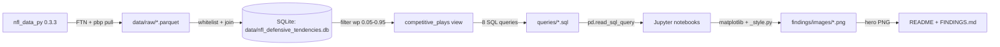

# Phase 4: Story & Ship — Pattern Map

**Mapped:** 2026-04-30
**Files analyzed:** 8 (6 greenfield artifacts + 2 modify-in-place targets)
**Analogs found:** 7 strong / 8 (only `.github/workflows/ci.yml` is fully greenfield with no in-repo CI analog)

---

## File Classification

| New / Modified File | Role | Data Flow | Closest Analog | Match Quality |
|---------------------|------|-----------|----------------|---------------|
| `analysis/03_visualizations.ipynb` (+ paired `.py`) | notebook | read-DB → static-figure-export | `analysis/02_predictability_modeling.py` + `analysis/01_exploratory.py` | exact (jupytext + `_common`/`_style` + SQL→pandas→matplotlib pipeline) |
| `analysis/02_predictability_modeling.py` (S3 chi-square cells appended) | analytical-cell append | request-response (DB → contingency → stats) | Same file, S1 chi-square block (lines 252–330) | exact (structural template — same statistical reporting battery) |
| `findings/FINDINGS.md` | memo | doc | `docs/ftn-schema-audit.md` (closest in-repo voice) + `docs/analysis-plan.md` (closest in-repo structure) | role-match (no prior memo, but voice + numbers-first prose are established) |
| `README.md` (hand-rewrite over existing skeleton) | doc | doc | Existing `README.md` skeleton (placeholders to fill) + `docs/ftn-schema-audit.md` (voice) | exact (skeleton dictates section order; voice from docs/) |
| `data/README.md` (modify) | doc | doc | Existing `data/README.md` (already 3 lines on the regen path) | exact (extend, don't replace) |
| `findings/images/01_predictability_ranking.png` | artifact (PNG) | static export | None in repo (greenfield); style contract in `_style.py` | role-match (`apply_style()` + `savefig.dpi=200` already locked) |
| `findings/images/02_kl_vs_h_scatter.png` | artifact (PNG) | static export | None in repo (greenfield); style contract in `_style.py` | role-match (same `apply_style()` pipeline) |
| `.github/workflows/ci.yml` | workflow | CI | None in repo; closest spirit-analog is `scripts/_verify_queries_run.py` (verifier shape, regex grep semantics) | no analog (greenfield) |

---

## Pattern Assignments

### `analysis/03_visualizations.ipynb` (+ paired `.py`) — VIZ-01..05

**Analog:** `analysis/02_predictability_modeling.py` (1–146) + `analysis/01_exploratory.py` (1–66)

**Jupytext header (mandatory verbatim, lines 1–14 of either analog):**

```python
# ---
# jupyter:
#   jupytext:
#     formats: ipynb,py:percent
#     text_representation:
#       extension: .py
#       format_name: percent
#       format_version: '1.3'
#       jupytext_version: 1.19.1
#   kernelspec:
#     display_name: Python 3 (ipykernel)
#     language: python
#     name: python3
# ---
```

The `formats: ipynb,py:percent` line is the load-bearing one — it's what makes `jupytext --sync` produce the paired `.py` cleanly.

**Title-cell + intent docblock pattern** (`02_predictability_modeling.py` lines 16–55, `01_exploratory.py` lines 16–34):

```python
# %% [markdown]
# # Visualizations — VIZ-01..05 (Phase 4)
#
# This notebook is the VIZ-01..05 deliverable. It exports two PNGs to
# `findings/images/` using `_style.py` rcParams:
# - `01_predictability_ranking.png` — hero leaderboard (32 teams, 0–100, top-3/bottom-3 highlighted)
# - `02_kl_vs_h_scatter.png` — rank-rank scatter (D-15 divergence; 8 callouts)
# Plus the 1280×640 social-preview render from the same parameterized leaderboard
# function, top-12 only.
#
# Outputs are cleared via `nbconvert --clear-output --inplace` before commit
# per CLAUDE.md File-Organization Rules. Hero PNGs live only in `findings/images/`,
# never inside committed notebook outputs.
```

**Sys-path-bootstrap + import block** (`02_predictability_modeling.py` lines 57–92 — copy verbatim):

```python
# %%
import logging
import sys
from pathlib import Path

# Ensure repo root is on sys.path so `analysis.*` imports resolve regardless of
# the kernel's working directory. `__file__` is not defined in .ipynb cells, so
# we use Path.cwd() which resolves to the repo root when run via nbconvert or
# JupyterLab launched from the repo root.
_REPO_ROOT = Path.cwd()
# Walk up until we find analysis/ or hit the filesystem root (defensive).
for _candidate in [_REPO_ROOT, _REPO_ROOT.parent, _REPO_ROOT.parent.parent]:
    if (_candidate / "analysis").is_dir():
        _REPO_ROOT = _candidate
        break
if str(_REPO_ROOT) not in sys.path:
    sys.path.insert(0, str(_REPO_ROOT))

import matplotlib.pyplot as plt  # noqa: E402
import numpy as np  # noqa: E402
import pandas as pd  # noqa: E402
import seaborn as sns  # noqa: E402, F401
from scipy import stats  # noqa: E402

from analysis._common import DB_PATH, SEED, get_conn, min_n_filter  # noqa: E402, F401
from analysis._style import apply_style  # noqa: E402

logging.basicConfig(level=logging.INFO, format="%(levelname)s - %(message)s")
apply_style()
np.random.seed(SEED)

assert DB_PATH.exists(), f"Phase 2 DB not found at {DB_PATH}; run `python -m etl.run` first"

QUERIES_DIR = _REPO_ROOT / "queries"
```

**SQL loading idiom** (`02_predictability_modeling.py` lines 90–92, then 138–140):

```python
SQL_PRED_RAW = (QUERIES_DIR / "07_situational_predictability_score.sql").read_text(encoding="utf-8")

with get_conn() as conn:
    raw = pd.read_sql_query(SQL_PRED_RAW, conn)
```

**Notes on data flow for this notebook:**
- Reads from `data/nfl_defensive_tendencies.db` via `_common.get_conn()`.
- Reads `queries/07_situational_predictability_score.sql` (predictability scalar inputs) and `queries/01_tendency_distribution_by_team.sql` (KL leaderboard inputs) — same idiom as above.
- Writes two PNGs to `findings/images/` plus the social-preview PNG.
- `apply_style()` MUST be called after imports and before any `plt` figure is created (D-26, D-33 — colors and fonts come from `_style.py`).
- The `colorblind` palette is locked in `_style.py:PALETTE`; D-28 directs the executor to pick the bottom-3 hero color from this palette (not red). `seaborn.color_palette("colorblind")` returns the canonical list — index 1 (orange-ish) and 2 (green) are the natural non-red picks.

**Patterns to NOT replicate from elsewhere:**
- Do NOT use `Path("../audit")`-style relative paths from the notebook directory (that pattern lives in `00_data_audit.py:42` for a Phase 1 audit-CSV write; Phase 4 uses the `_REPO_ROOT / "findings" / "images"` absolute pattern instead).
- Do NOT embed figures in committed `.ipynb` outputs — VIZ-04 requires `nbconvert --clear-output --inplace` before commit.
- Do NOT add Plotly, Bokeh, or Streamlit imports — locked stack (CLAUDE.md) is matplotlib + seaborn only.

---

### `analysis/02_predictability_modeling.py` — S3 chi-square cells appended

**Analog:** Same file, S1 chi-square block (lines 252–330) is the structural template.

**The S1 cell-level docblock + Rule-1-bug-fix preface** (lines 252–264) — the S3 cells append AFTER this S1 block and BEFORE the existing STAT-08 sensitivity block at line 332:

```python
# %% [markdown]
# ## STAT-06 chi-square headline: PA × blitz on S1 (D-09 + D-11 + D-12)
#
# League-aggregate 2×2 contingency on S1 (3rd-and-long) pass plays from `competitive_plays`:
# rows = `n_blitzers >= 1` (y/n), cols = `is_play_action` (y/n).
# Tests the pre-registered PA cross-cutting hypothesis from `docs/analysis-plan.md`.
#
# DEVIATION (Rule 1 — bug fix): plan specified `n_blitzers > 4` ...
```

**The S3 markdown header MUST carry the explicit exploratory tag per D-12** (mirror the S1 docblock style; this is the `# EXPLORATORY — NOT pre-registered in docs/analysis-plan.md` comment from the CONTEXT brief):

```python
# %% [markdown]
# ## EXPLORATORY: PA × blitz on S3 (1st-and-10) — NOT pre-registered in docs/analysis-plan.md
#
# Per Phase 4 / 04-CONTEXT D-10..D-15. The S1 chi-square (above) is the
# pre-registered headline; this cell is the exploratory follow-up that tests
# the same mechanism on the situation where PA actually fires (PA rate on S3
# = 46.49% vs 1.235% on S1). The S3 universe gives the chi-square inferential
# power the S1 N=109 stratum cannot.
#
# Universe: competitive_plays JOIN ftn_play, down=1 AND ydstogo=10 AND play_type='pass'.
# Verified: N total = 18,609; N(PA=1) = 8,652; N(PA=0) = 9,957.
#
# Reporting structure mirrors S1 (chi² + p, expected min cell, OR + 95% CI,
# Wilson CI on P(blitz | PA=1, S3), paired P(blitz | PA=0, S3), observed pp gap)
# PLUS first-class OR delta vs S1 per D-11.
```

**SQL definition pattern** (mirror lines 266–278 — inline triple-quoted SQL string for the contingency rollup; differs from notebook-level `SQL_PRED_RAW` reads which load from `queries/*.sql` files because this is a one-cell ad-hoc rollup):

```python
# %%
S3_PA_BLITZ_SQL = """
SELECT
    f.is_play_action,
    SUM(CASE WHEN f.n_blitzers >= 1 THEN 1 ELSE 0 END)  AS blitz_count,
    SUM(CASE WHEN f.n_blitzers = 0 THEN 1 ELSE 0 END)   AS no_blitz_count
FROM competitive_plays cp
JOIN ftn_play f USING (game_id, play_id)
WHERE cp.down = 1 AND cp.ydstogo = 10
  AND cp.play_type = 'pass'
  AND f.is_play_action IS NOT NULL
GROUP BY f.is_play_action
"""

with get_conn() as conn:
    s3 = pd.read_sql_query(S3_PA_BLITZ_SQL, conn)

print(s3)
```

**The full statistical reporting battery** (lines 285–330 — copy verbatim, swap `s1`→`s3`, `S1`→`S3`):

```python
# Build the 2x2 contingency in the order required by D-09:
#   [[blitz=1 & PA=1, blitz=0 & PA=1],
#    [blitz=1 & PA=0, blitz=0 & PA=0]]
row_pa = s3.loc[s3["is_play_action"] == 1].iloc[0]
row_no = s3.loc[s3["is_play_action"] == 0].iloc[0]
a3 = int(row_pa["blitz_count"])
b3 = int(row_pa["no_blitz_count"])
c3 = int(row_no["blitz_count"])
d3 = int(row_no["no_blitz_count"])
table_s3 = np.array([[a3, b3], [c3, d3]])
print(f"S3 PA x blitz contingency:\n{table_s3}")

chi2_s3, p_s3, _, expected_s3 = stats.chi2_contingency(table_s3)
print(f"chi2 = {chi2_s3:.4f}")
print(f"p-value = {p_s3:.6f}")
print(f"expected cells (min={expected_s3.min():.1f}): chi-square assumption holds")

odds_ratio_s3 = (a3 * d3) / (b3 * c3)
log_or_s3 = np.log(odds_ratio_s3)
se_log_or_s3 = np.sqrt(1.0 / a3 + 1.0 / b3 + 1.0 / c3 + 1.0 / d3)
or_lo_s3 = float(np.exp(log_or_s3 - 1.96 * se_log_or_s3))
or_hi_s3 = float(np.exp(log_or_s3 + 1.96 * se_log_or_s3))
print(f"OR={odds_ratio_s3:.3f}  95% CI=[{or_lo_s3:.3f}, {or_hi_s3:.3f}]")

# Wilson CI on P(blitz | PA=1, S3); reuse the closed-form pattern from S1.
p_hat_s3 = a3 / (a3 + b3)
n_pa_s3 = a3 + b3
z = 1.96
z2 = z * z
denom = 1.0 + z2 / n_pa_s3
centre = (p_hat_s3 + z2 / (2 * n_pa_s3)) / denom
half = (z * np.sqrt(p_hat_s3 * (1 - p_hat_s3) / n_pa_s3 + z2 / (4 * n_pa_s3 * n_pa_s3))) / denom
wilson_lo_s3, wilson_hi_s3 = float(centre - half), float(centre + half)
print(f"P(blitz | PA=1, S3) = {p_hat_s3:.4f}  Wilson CI=[{wilson_lo_s3:.4f}, {wilson_hi_s3:.4f}]  (N={n_pa_s3})")
p_no_s3 = c3 / (c3 + d3)
print(f"Paired: P(blitz | PA=0, S3) = {p_no_s3:.4f}  (N={c3 + d3})")
print(f"Observed pp gap (S3) = {(p_hat_s3 - p_no_s3) * 100:+.2f}pp")
```

**OR delta block — first-class output per D-11 (NEW pattern; no exact analog in S1 cell):**

```python
# Per 04-CONTEXT D-11: report OR delta between S1 and S3 as a first-class output.
# (S1 OR is in scope `odds_ratio` from the S1 cell above; ensure this S3 cell runs
# AFTER the S1 cell so the variable is in the kernel namespace.)
or_delta = odds_ratio_s3 - odds_ratio
print(f"OR delta (S3 - S1) = {or_delta:+.3f}  (S1 OR={odds_ratio:.3f}, S3 OR={odds_ratio_s3:.3f})")
print("Direction agreement: " + ("yes" if (odds_ratio < 1 and odds_ratio_s3 < 1) or (odds_ratio > 1 and odds_ratio_s3 > 1) else "no"))
```

**Notes on data flow:**
- Reads from `data/nfl_defensive_tendencies.db` via the same `get_conn()` import already in the notebook.
- Depends on `s1` cell variables (`odds_ratio`, `a, b, c, d`) being in the kernel namespace — append AFTER the S1 cell, BEFORE the STAT-08 sensitivity cell at line 332.
- The final `## Limitations + sample-size discipline summary` cell at line 423 should be extended to print the S3 result alongside S1 (one extra line in the summary block).

**Patterns to NOT replicate from elsewhere:**
- Do NOT remove or alter the S1 cell — D-04 keeps S1 + S3 as separate insights.
- Do NOT load this SQL from a `queries/*.sql` file — the existing inline pattern (S1 uses `S1_PA_BLITZ_SQL = """..."""`) is the established convention for one-shot contingency rollups; only the team-level rollups and per-team analytical queries live in `queries/`.

---

### `findings/FINDINGS.md` — DOC-01, DOC-02

**Analog:** `docs/ftn-schema-audit.md` (closest in-repo voice + memo prose density) + `docs/analysis-plan.md` (closest in-repo structure with named hypotheses, falsifiability, sample-size discipline visible).

**Voice analog — opening paragraph pattern from `docs/ftn-schema-audit.md` lines 1–14:**

```markdown
# FTN Schema Audit (Phase 1 Pivot Calibration)

The 29 columns of the public FTN charting subset distributed via nflverse contain
zero coverage labels. The full Cover-0-through-6 / man-zone taxonomy is part of
FTN's paid product (`ftnfantasy.com/data`), not the CC-BY-SA subset. This audit
confirms the project's pivot to broader defensive tendencies (pressure,
play-fakery, and personnel/location) using the columns FTN does include.

I pulled `nfl.import_ftn_data([2022, 2023, 2024, 2025])` against the live
nflverse CDN on 2026-04-29 and joined to `nfl.import_pbp_data` on
`(nflverse_game_id, nflverse_play_id)` with `validate='one_to_one'`. The join
matched 185,215 of 185,215 FTN rows against 197,362 pbp rows. The observed
match rate was 0.9999, well above the 0.95 floor required for the join to be
analytically trustworthy.
```

Notes on what makes this voice land:
- First sentence states a numerical fact (29 columns, zero coverage labels).
- Second sentence names the constraint (paid product, CC-BY-SA subset).
- No emoji headers, no exclamation points, no "Welcome" / "In this document I will".
- Numbers inline with claims (185,215 of 185,215; 0.9999; 0.95 floor).

**Structure analog — falsifiable-claim format from `docs/analysis-plan.md` lines 36–45:**

```markdown
**Hypotheses (falsifiable):**

- H1: League-wide blitz rate (`n_blitzers > 4`) on 3rd-and-long exceeds 35%
  over 2022-2025. **Falsified if** observed league-wide rate <= 35% with
  N >= 1,000 (the threshold is met across 4 seasons of every team's
  3rd-and-long pass plays; sample size is not the gate).
```

The FINDINGS insights mirror this pattern but invert it (claim → evidence → caveat per D-05 fixed 3-sentence template).

**Sample-size table format from `docs/analysis-plan.md` lines 154–161 — directly transferable to FINDINGS appendix T1:**

```markdown
| Universe / Situation | N |
|---|---|
| Total competitive plays | 105,556 |
| S1 / 3rd-and-long (`down=3 AND ydstogo>=7`) | 9,925 |
| S2 / Red zone (`yardline_100<=20`) | 15,559 |
| S3 / 1st-and-10 (`down=1 AND ydstogo=10`) | 41,901 |
| S4 / 2nd-and-medium (`down=2 AND ydstogo BETWEEN 3 AND 6`) | 10,513 |
```

Appendix tables T1–T4 (D-17) follow this same column-aligned table style — no fancy formatting, plain pipe-tables that GitHub renders cleanly.

**Concrete numbers to surface in FINDINGS prose** (verified in `04-PRE-DISCUSS-BRIEF.md` against the live DB):
- Insight #1 (leaderboard): top-3 PHI 23.53, SF 23.48, IND 22.37; bottom-3 NE 6.54 / KC 6.21 / MIA 5.91 / TB 4.07 / MIN 1.53 (recall it's "bottom-3" by D-09, so MIA / TB / MIN by score).
- Insight #2 (D-15): Spearman ρ = -0.111, p = 0.546. Top-5 disagreers MIN, TB, PIT, MIA, DET (rank Δ ≥ 22).
- Insight #3 (S1 chi-square, pre-registered): χ² = 3.4643, p = 0.0627; OR = 0.648 [0.418, 1.003]; Wilson [0.176, 0.336]; gap = -8.94pp; N=8,825 with PA=1 stratum N=109.
- Insight #4 (S3 chi-square, exploratory — TBD at execution time): N=18,609; PA=1 N=8,652. Numbers come out of the cell appended above.
- Insight #5 (red-zone pressure): RZ pressure 36.2% vs midfield 26.7%; +9.5pp gap. Source: QUERY-03.
- Insight #6 (team-level beat): DET 52.3% S1 blitz rate (verify at execution time per CONTEXT Claude's Discretion). Source: QUERY-05.
- D-16 sensitivity: Spearman ρ = 0.982, max |rank Δ| = 4.

**Attribution block — copy from CLAUDE.md voice plus the standard CC-BY-SA framing.** No prior in-repo attribution block analog; pattern is standard:

```markdown
## Attribution

Data sources:
- **FTN charting** via the [nflverse](https://github.com/nflverse) project, distributed under [CC-BY-SA 4.0](https://creativecommons.org/licenses/by-sa/4.0/).
- **nflfastR** play-by-play via `nfl_data_py==0.3.3`.

This work is shared under the same CC-BY-SA 4.0 license inheritance for any
data-derived claim or chart; the project's own code is MIT (see `LICENSE`).
```

**Patterns to NOT replicate from elsewhere:**
- Do NOT use emoji section headers (e.g., `## :rocket: TL;DR`, `## :chart_with_upwards_trend: Findings`) — explicitly forbidden by CLAUDE.md "Audience Voice".
- Do NOT use exclamation points or AI-template tone ("Welcome!", "In this exciting analysis...").
- Do NOT introduce footnotes or `[^1]` references that GitHub renders inconsistently — keep claims inline with N parenthetical.
- Do NOT pluralize "data" as a verb-subject (e.g., "the data show") inconsistently — `docs/ftn-schema-audit.md` and `docs/analysis-plan.md` treat "data" as singular ("the public FTN dataset"); maintain that.

**Notes on data flow:**
- Reads numerical inputs from `analysis/02_predictability_modeling.py` (post-execution stdout / leaderboard CSV-or-pickle if intermediate) and from the SQL queries' result rows.
- Reads N counts from `data/nfl_defensive_tendencies.db` via the same SQL queries the analysis layer uses.
- Embeds `findings/images/01_predictability_ranking.png` (hero) — file path resolution from `findings/FINDINGS.md` is `images/01_predictability_ranking.png` (relative).
- The four prose locations from D-48 (PROJECT.md L58, 03-CONTEXT.md D-02, `docs/ftn-schema-audit.md` line 78 anchor `n_blitzers > 4`, README glossary) are NOT this file's territory — Plan 04-02 README hand-rewrite owns the cross-doc sweep; FINDINGS.md authors with `n_blitzers > 0` from inception.

---

### `README.md` — DOC-03..07 hand-rewrite + cross-doc reconciliation sweep

**Analog:** Existing `README.md` skeleton (already in repo; 32 lines, placeholder slots `<MOST_PREDICTABLE_DEFENSE_2025>`, `<SCORE>`, `<DELTA>` per BOOT-06 and post-AUDIT-07 hook rewrite). Voice analog: `docs/ftn-schema-audit.md` (paragraph 1) for the post-pivot framing.

**The skeleton's section order (preserve):**

```markdown
# NFL Defensive Tendencies

## Hook                  # already drafted — reconcile S1-vs-cross-situation per D-48
## Findings preview      # 3-4 stat-first bullets (DOC-03)
## Architecture          # Mermaid data-flow diagram (DOC-04)
## Setup                 # 5-command block (DOC-05)
## Glossary              # 6 terms (DOC-06)
## Methodology           # short; link to FINDINGS.md
## Limitations           # short; full set lives in FINDINGS.md L1..L4 + L6
## Attribution           # CC-BY-SA (DOC-07)
## Known Issues          # nfl_data_py archival, L5 (DOC-07)
```

The locked-skeleton section order matches DOC-03 through DOC-07 one-for-one; do not reorder.

**Hook reconciliation pattern** — current line 5 reads:

```markdown
Some NFL defenses are more predictable than others on third-and-long.
```

Per D-48 + D-32 (the hero chart title trims "on third-and-long" because the leaderboard aggregates across all 4 pre-registered situations), the README hook MUST reconcile to cross-situation framing OR commit to S1 in the prose with a footnote that the leaderboard is cross-situation. Planner's call. Recommended phrasing (matches D-32 chart title): "Some NFL defenses are more predictable than others. This project ranks all 32 across four pre-registered situations (3rd-and-long, red zone, 1st-and-10, 2nd-and-medium) using four seasons (2022-2025, through Super Bowl LX) of nflfastR play-by-play and FTN charting."

**Mermaid data-flow diagram pattern** — no in-repo analog; standard GitHub-rendering form per D-41. Suggested template:

````markdown
## Architecture



Eyeball the GitHub-rendered output during private staging — Mermaid renderer
diverges from local previews on edge cases.
````

The `Eyeball` note traces back to D-41 + the verification spec.

**Setup block — 5-command pattern (DOC-05):**

```markdown
## Setup

```bash
git clone https://github.com/<user>/nfl-defensive-tendencies.git
cd nfl-defensive-tendencies
python3.11 -m venv .venv && source .venv/bin/activate
pip install -r requirements.txt
python -m etl.run                  # ~2-5 min cold cache; regenerates data/nfl_defensive_tendencies.db
```

Reproducibility budget: ≤ 5 commands, ≤ 10 minutes on a stock laptop after the first `nfl_data_py` pull.
```

The 5-command list comes from PROJECT.md "Reproducibility budget" + the existing `.python-version` (3.11) + `requirements.txt` + `etl/run.py` already-locked surface. Windows users get `.venv\Scripts\activate` instead — the README can show the POSIX form and add a one-line Windows note, which is the convention `docs/ftn-schema-audit.md` follows when names diverge across platforms.

**Glossary pattern (DOC-06)** — no prior glossary in repo; `docs/ftn-schema-audit.md` "Selection rule" prose (lines 37–47) is the closest "explain a domain concept tersely" analog. Six terms per CONTEXT (down, distance, EPA, blitz, RPO, predictability index). Voice: one-sentence definition each; prose-style not bulleted-attribute-list.

```markdown
## Glossary

- **Down.** A play attempt. The offense gets four downs to gain 10 yards or score; failure turns the ball over.
- **Distance.** Yards needed for a first down on the next play. "3rd-and-long" means 3rd down with 7+ yards to gain.
- **EPA (Expected Points Added).** A play-level value capturing how much a play improved (or hurt) the offense's expected scoring outcome.
- **Blitz.** When a defense sends extra rushers beyond its base 4-man front. Operationally in this project: `n_blitzers > 0` (any FTN-charted extra rusher).
- **RPO (Run-Pass Option).** A play where the QB reads a defender post-snap and chooses run or pass.
- **Predictability index.** A 0-100 score per defense per situation, derived from normalized Shannon entropy `H/log(2)` over the blitz/no-blitz binary; 0 = uniform 50/50 (truly random), 100 = deterministic.
```

The blitz term carries the D-48 reconciliation — `n_blitzers > 0`, NOT `> 4`. After this glossary lands, run a repo-wide grep for `n_blitzers > 4` per D-49.

**Attribution block (DOC-07)** — same pattern as the FINDINGS.md attribution above; copy-paste with consistent wording across both files.

**Known Issues block (DOC-07)** — no prior in-repo analog; this is L5 from the FINDINGS limitations expansion. Suggested phrasing (mirrors `docs/ftn-schema-audit.md` "Subsequent finding worth flagging for v2" tone, lines 117–133):

```markdown
## Known Issues

- **`nfl_data_py` archived 2025-09-25.** Upstream stopped accepting changes; this project pins `==0.3.3` and accepts the maintenance risk for v1. The numpy<2.0 constraint is a downstream consequence (the package references `np.float_`, removed in NumPy 2). The maintained successor is `nflreadpy`; migration is a v2 candidate (see `.planning/PROJECT.md`).
```

**Patterns to NOT replicate from elsewhere:**
- No emoji headers anywhere — re-read CLAUDE.md "Audience Voice" before authoring.
- No "Welcome!" / "I built this!" / first-person-effusive tone.
- No shields.io badge soup (>5 badges); the requirements file already explicitly excludes this. CI badge + Python version badge + license badge = ceiling. Skip "made with love" / "PRs welcome" badges.
- Do NOT add a `<details>` HTML expandable — GitHub renders it but adds visual noise; recruiters skim, they don't expand.

**Notes on data flow:**
- Reads `findings/images/01_predictability_ranking.png` (must exist before this README lands per phase-internal serialization).
- Authoritative numerical anchors come from FINDINGS.md TL;DR (so README and FINDINGS stay aligned).
- D-49 grep sweep targets: PROJECT.md L58, 03-CONTEXT.md D-02 line ~ (search), `docs/ftn-schema-audit.md` line 78, README glossary. Run `grep -rn "n_blitzers > 4" .` after editing — expect zero matches.

---

### `data/README.md` (modify) — DOC-08

**Analog:** Existing `data/README.md` (already 7 lines covering the basics).

**Current content (verbatim):**

```markdown
# Data

The SQLite database `data/nfl_*.db` is gitignored (200–400 MB exceeds GitHub's 100 MiB hard limit).

To regenerate from a fresh clone: `python -m etl.run` (Phase 2 deliverable; ~2–5 min on first run).

Raw `nfl_data_py` parquet caches land in `data/raw/` (also gitignored). The ETL creates this directory at runtime.
```

**What DOC-08 needs added:**
- Specific filename: `data/nfl_defensive_tendencies.db` (was generic `nfl_*.db`).
- Specific row counts (already verified in Phase 2 / 04-CONTEXT line 247): 1,139 games / 197,362 plays / 185,215 ftn_play / 105,556 competitive_plays / 58,178 competitive pass plays.
- Schema reference: `schema/01_create_tables.sql` + `schema/02_indexes.sql` + `schema/03_views.sql`.
- Parquet cache layout: `data/raw/pbp_<year>.parquet` and `data/raw/ftn_<year>.parquet` per year 2022–2025 (8 files total, ~80 MB combined).

**Pattern to extend (NOT replace):**

```markdown
# Data

This directory holds the project's data layer. The SQLite database is the analytical source of truth and is regenerated from a fresh clone via the ETL pipeline.

## Files

- `data/nfl_defensive_tendencies.db` — **gitignored** (200–400 MB exceeds GitHub's 100 MiB hard limit). Regenerate via `python -m etl.run`. Contains 1,139 games / 197,362 plays / 185,215 ftn_play rows / 105,556 competitive_plays / 58,178 competitive pass plays joined to FTN, 2022–2025.
- `data/raw/*.parquet` — **gitignored**. The ETL caches `nfl_data_py` pulls here on first run; subsequent runs are idempotent. Layout: `pbp_<year>.parquet` + `ftn_<year>.parquet` per year (8 files, ~80 MB combined).
- `data/README.md` — this file.

## Regeneration path

```bash
python -m etl.run
```

Cold cache: ~2–5 minutes. Warm cache (parquet files already populated): under 60 seconds.

## Schema

DDL lives in `schema/`:
- `schema/01_create_tables.sql` — `games`, `plays`, `ftn_play` tables with `(game_id, play_id)` PKs.
- `schema/02_indexes.sql` — composite indexes on `(down, ydstogo, yardline_100)` and `(defteam, season)`.
- `schema/03_views.sql` — `competitive_plays` view (the project-wide analytical universe; `play_type IN ('pass','run')` AND `wp BETWEEN 0.05 AND 0.95` AND not 2-minute drill / OT).

Every analytical query in `queries/*.sql` reads from `competitive_plays`, never from `plays` directly.
```

**Patterns to NOT replicate from elsewhere:**
- Do NOT add row-count claims that aren't verified against the actual DB build — copy the figures from PROJECT.md Phase 2 record / 04-CONTEXT line 247.
- Do NOT add a "schema diagram" image — the schema is three small SQL files; pointing at them by name is more useful than drawing them.

**Notes on data flow:**
- Read-only documentation. Sources its numbers from `.planning/PROJECT.md` Phase 2 record + the actual DB metadata.
- This is the smallest of the docs deliverables — single editorial pass, ≤ 60 lines total.

---

### `findings/images/01_predictability_ranking.png` + `02_kl_vs_h_scatter.png` + social-preview PNG

**Analog:** No prior in-repo PNGs; `findings/images/.gitkeep` is the only file in that directory. The contract is `_style.py:apply_style()` + `_style.py:RCPARAMS` (lines 25–39, copied below for plan reference):

```python
RCPARAMS: dict[str, object] = {
    "savefig.dpi": 200,
    "savefig.bbox": "tight",
    "figure.dpi": 100,
    "figure.figsize": (8.0, 5.0),
    "font.size": 11,
    "axes.titlesize": 13,
    "axes.labelsize": 11,
    "axes.spines.top": False,
    "axes.spines.right": False,
    "xtick.labelsize": 10,
    "ytick.labelsize": 10,
    "legend.fontsize": 10,
    "legend.frameon": False,
}

PALETTE: str = "colorblind"
```

**Hero leaderboard file spec (D-33):** `findings/images/01_predictability_ranking.png`, portrait ~8×11" @ 200 DPI. The portrait orientation overrides `_style.py`'s default `figure.figsize=(8.0, 5.0)` — pass `figsize=(8, 11)` directly to `plt.subplots()` for this chart.

**Scatter file spec (D-26):** `findings/images/02_kl_vs_h_scatter.png`, square 8×8" @ 200 DPI. Same `apply_style()` pipeline; pass `figsize=(8, 8)` to override default. `adjustText` (or matplotlib's built-in `annotate` with manual offset) handles the 8 callout labels.

**Social-preview file spec (D-34):** filename per executor's choice (suggested `findings/images/social_preview_top12.png` or `findings/images/01_predictability_ranking_top12.png`); landscape 1280×640 px. At 200 DPI that's `figsize=(6.4, 3.2)` (since 1280 / 200 = 6.4). Same data source + style pipeline as the hero, just `top_n=12` parameter through the parameterized leaderboard function.

**Library availability check:** `adjustText` is NOT in `requirements.txt` — Plan 04-01 must either add it (with a tight version pin like `adjustText>=1.0,<2`) OR fall back to manual `ax.annotate(..., xytext=(...), textcoords='offset points')` placement. Adding to requirements.txt is the cleaner path; it's a small dependency.

**Patterns to NOT replicate from elsewhere:**
- Do NOT use red for the bottom-3 hero color (D-28). The colorblind palette has muted orange (palette index 1, `#de8f05`) and dark teal (index 2, `#029e73`) — both work.
- Do NOT truncate the hero x-axis (D-30 — fixed 0–100).
- Do NOT use 2-decimal score annotations (D-31 — one decimal).

**Notes on data flow:**
- `findings/images/` is committed to git (so README and FINDINGS embeds work); it's not in `.gitignore`. The PNGs at 200 DPI in the 30–80 KB band stay well under any practical git-size concern.
- Hero PNG must exist before README and FINDINGS render correctly on GitHub — phase-internal serialization gate per ROADMAP "04-01 is the serial prerequisite."

---

### `.github/workflows/ci.yml` — SHIP-01 + SHIP-08

**Analog:** No prior `.github/workflows/` in repo. Closest in-repo spirit-analog: `scripts/_verify_queries_run.py` (lines 1–98) — same "regex check + execution smoke + exit code" shape, just translated from Python-script-on-laptop to YAML-job-on-GitHub-runner.

**Verifier-pattern translation:** The Python verifier uses `re.search(...)` to validate header structure (`scripts/_verify_queries_run.py:70-74`). The CI workflow's SHIP-08 step uses `grep -qE` for the equivalent placeholder check on README + FINDINGS. The shape parallel is intentional — a recruiter inspecting the CI step can read it as "the same kind of meta-check the local verifier does, but ship-gated."

**The full workflow file template (greenfield; D-44 + D-45 + D-46):**

```yaml
name: CI

on:
  push:
    branches: [main]
  pull_request:
    branches: [main]

concurrency:
  group: ${{ github.workflow }}-${{ github.ref }}
  cancel-in-progress: true

jobs:
  lint-and-import-smoke:
    runs-on: ubuntu-latest
    steps:
      - name: Checkout
        uses: actions/checkout@v4

      - name: Set up Python 3.11
        uses: actions/setup-python@v5
        with:
          python-version: '3.11'
          cache: 'pip'

      - name: Install dependencies
        run: |
          python -m pip install --upgrade pip
          pip install -r requirements.txt

      - name: Lint with ruff
        run: ruff check .

      - name: Import smoke (etl + analysis modules)
        run: |
          python -c "import etl"
          python -c "from analysis import _common, _style"

      - name: SHIP-08 placeholder regex check
        run: |
          ! grep -qE '<[A-Z_]{4,}>' README.md
          ! grep -qE '<[A-Z_]{4,}>' findings/FINDINGS.md
```

The exact regex pattern `<[A-Z_]{4,}>` is verbatim from REQUIREMENTS.md SHIP-08. It catches `<MOST_PREDICTABLE_DEFENSE_2025>` (the kind of placeholder currently in the README) but not normal HTML-like `<br>` or `<a>` (which are < 4 uppercase chars).

**The `! grep -qE` idiom is intentional:** in bash under `set -e` (which GitHub Actions sets by default for `run: |`), `grep -q` returns 0 on match and 1 on no-match. Inverting with `!` means "fail the step if the regex matches" — exactly the semantics SHIP-08 wants.

**The `import etl` step works because `etl/__init__.py` exists** (Phase 2 ETL-05 deliverable). The `from analysis import _common, _style` step works because `analysis/_common.py` and `analysis/_style.py` exist; `analysis/__init__.py` may or may not exist — check before authoring. If absent, either add an empty one in this plan (low-cost) or write the import as `python -c "import sys; sys.path.insert(0, '.'); import analysis._common, analysis._style"`. The first path is cleaner.

**Patterns to NOT replicate from elsewhere:**
- Do NOT add `nbconvert --execute` notebook execution (REQUIREMENTS.md "Out of Scope" line 141: pulls 150 MB on every run, flaky). The notebook reproducibility check is the local SHIP-02 fresh-venv ritual, not CI.
- Do NOT add multiple jobs (D-44: single job; multi-job triples compute spend for ~30 sec wall-clock saving).
- Do NOT add a Python-version matrix (CONTEXT "Deferred" line 328 — locked stack pins 3.11 only).
- Do NOT add scheduled runs (D-45 — anxiety without action on archived `nfl_data_py`).
- Do NOT add SQL static checks (D-47 — duplicates `scripts/_verify_queries_run.py`).

**Notes on data flow:**
- Workflow reads from the repo at `${{ github.ref }}` checkout time.
- No DB, no parquet cache — pure source-tree static checks.
- Triggered by `push` to main (the post-merge CI badge) and `pull_request` to main (the merge-gate per D-39 branch protection).

---

## Shared Patterns

### Sys-path bootstrap + import block (notebook-only)
**Source:** `analysis/02_predictability_modeling.py` lines 57–92, identical to `analysis/01_exploratory.py` lines 36–66.
**Apply to:** `analysis/03_visualizations.py` (the new VIZ notebook). The S3 chi-square cells appended to `02_predictability_modeling.py` already inherit the imports — no changes needed.
**Pattern:** Copy verbatim. Use `Path.cwd()` walk-up (NOT `Path(__file__)`) — see analog comment at line 65 explaining why.

### `apply_style()` + `np.random.seed(SEED)` invocation
**Source:** `analysis/02_predictability_modeling.py` lines 84–86; `analysis/01_exploratory.py` lines 61–63.
**Apply to:** Every notebook in `analysis/`. Phase 4's `03_visualizations.py` MUST call both, in that order, after the imports and before any figure is created.

### `assert DB_PATH.exists()` defensive gate
**Source:** `analysis/02_predictability_modeling.py` line 88; `analysis/01_exploratory.py` line 65.
**Apply to:** Every notebook that reads from the DB. Phase 4's viz notebook reads from the DB → carries this assertion.

### SQL header structured-docblock (6-section)
**Source:** `queries/01_tendency_distribution_by_team.sql` lines 1–8 (also 03, 05, 06, 07 — pattern uniform across slate).
**Apply to:** The methodology section of FINDINGS.md may reference this header structure when explaining the SQL slate ("every query carries a 6-section header — Question, Filter, Result shape, Hypothesis, Caveats, N expected"). Optional appendix mention; not load-bearing.

### Voice: numbers-first, no emoji, N inline
**Source:** `docs/ftn-schema-audit.md` paragraph 2 ("matched 185,215 of 185,215 FTN rows against 197,362 pbp rows. The observed match rate was 0.9999..."); `docs/analysis-plan.md` "Live counts" table.
**Apply to:** All Phase 4 prose — FINDINGS.md, README.md, data/README.md.
**Anti-pattern:** Anything starting with "Welcome to..." or section headers like `## :rocket: TL;DR`.

### `n_blitzers > 0` (NOT `> 4`) — the corrected operational definition
**Source:** All 8 `queries/*.sql` (line ~6 caveat in each, e.g., `01_tendency_distribution_by_team.sql:6`); `analysis/02_predictability_modeling.py` line 270.
**Apply to:** README glossary, FINDINGS.md methodology section block 1, and the four prose-reconciliation locations from D-48 (PROJECT.md L58, 03-CONTEXT.md D-02, `docs/ftn-schema-audit.md` line 78, README glossary). Run `grep -rn "n_blitzers > 4"` after the sweep per D-49 — expect zero matches.
**Note:** `analysis/01_exploratory.py:163` ALSO contains a stale `n_blitzers > 4` reference inside an SQL string. That file is a Phase 3 artifact and re-running it would re-fail. Plan 04-02 should fold this into the sweep (FIVE prose locations, not four — flag this to the planner).

### Attribution + CC-BY-SA inheritance
**Source:** No prior in-repo block (FINDINGS doesn't exist; current README is placeholder); standard pattern from CLAUDE.md "Public-Repo Discipline" + nflverse data licensing.
**Apply to:** README.md "Attribution" section + FINDINGS.md "Attribution" closing section. Use identical wording across both files for consistency.

### CI placeholder-regex grep
**Source:** REQUIREMENTS.md SHIP-08: `! grep -qE '<[A-Z_]{4,}>' <file>`.
**Apply to:** `.github/workflows/ci.yml` final step on README.md + findings/FINDINGS.md. Spirit-mirror of `scripts/_verify_queries_run.py:66-68` regex meta-check.

---

## GitHub MCP Tool Surface — Capability Note for Plan 04-03 (D-43)

**Connected MCP server:** `plugin:github:github` (verified via `claude mcp list` 2026-04-30).

**Tools the planner can assume exist** (standard GitHub MCP plugin surface; verify at execution time by attempting the call):
- `mcp__plugin_github_github__create_repository` — create new repo with name + description + private/public flag.
- `mcp__plugin_github_github__update_repository` — update description, topics, visibility (private→public flip per D-40).
- `mcp__plugin_github_github__push_files` — push initial code; alternative is plain `git push` after `git remote add origin`.
- `mcp__plugin_github_github__create_branch_protection` (or equivalent) — for D-39 branch protection on `main`.
- Standard PR / issue tools (not used in this phase).

**Tools that MAY NOT exist** (per D-43 — log path used in verification report):
- **Social preview image upload (SHIP-04).** GitHub's API supports `PATCH /repos/{owner}/{repo}` for some repo settings, but the social-preview image upload uses a separate endpoint that not all MCP plugins wrap. **Fallback path:** manual UI step at `https://github.com/<user>/nfl-defensive-tendencies/settings` → "Social preview" → upload PNG.
- **Profile pin (SHIP-05).** GitHub's GraphQL API supports `pinnedItems`, but MCP plugin coverage is inconsistent. **Fallback path:** manual UI step at `https://github.com/<user>` → "Customize your pins" → check the repo.

**Plan 04-03 rule per D-43:** Try MCP first; on tool-not-found OR permission failure, fall back to UI; log the path used in `04-03-SUMMARY.md`. The verification report names the path so a future-self running this knows what to expect.

---

## No Analog Found

| File | Role | Data Flow | Reason |
|------|------|-----------|--------|
| `.github/workflows/ci.yml` | workflow | CI | First CI workflow in this repo; the spirit-analog (`scripts/_verify_queries_run.py`) is a Python verifier, not YAML. Pattern is constructed from REQUIREMENTS.md SHIP-01 + SHIP-08, CONTEXT D-44..D-46, and standard `actions/checkout@v4` + `actions/setup-python@v5` GitHub Actions idiom. |
| Mermaid data-flow diagram (inside README.md) | doc | doc | No prior Mermaid in repo. Suggested template above; eyeball-verify GitHub render per D-41. |

---

## Metadata

**Analog search scope:** `analysis/`, `queries/`, `docs/`, `scripts/`, `data/`, repo root (README, requirements.txt, pyproject.toml, .gitignore).
**Files scanned:** 22 (5 analysis Python, 8 SQL queries, 2 docs MD, 1 verifier Python, 1 data MD, 1 README, 4 config files).
**Pattern extraction date:** 2026-04-30.
**MCP capability check:** `claude mcp list` confirms `plugin:github:github` connected; specific tool surface (social preview, profile pin) is verified at execution time per D-43.
