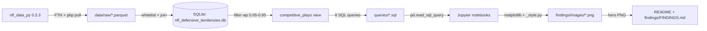

# NFL Defensive Tendencies

## Hook

Some NFL defenses are more predictable than others. This project ranks all 32 across four pre-registered situations (3rd-and-long, red zone, 1st-and-10, 2nd-and-medium) using four seasons (2022-2025, through Super Bowl LX) of nflfastR play-by-play and FTN charting. The public FTN columns cover pressure, play-fakery, and personnel; they don't include FTN's paid Cover-shell or man/zone labels, so this project anchors on what's there.

Result: a 0-100 predictability index where higher means more predictable. PHI leads the league at 23.5, about 9.2 points above the league average of 14.3.


## Findings preview

- PHI 23.5 / SF 23.5 / IND 22.4 lead the predictability leaderboard; MIA 5.9 / TB 4.1 / MIN 1.5 trail. League average: 14.3. (32 defenses, 4 seasons, 128 cells, all N >= 30.)
- On 3rd-and-long, defenses blitz 24.8% against play-action versus 33.7% otherwise — an 8.94pp gap (chi-square=3.46, p=0.063, OR=0.65 [0.42, 1.00]; N(PA=1)=109). Pre-registered; result is directional but marginal at alpha=0.05.
- Red-zone pressure rate (36.2%, N=7,553) runs 9.5 percentage points above midfield (26.7%, N=50,625). Source: queries/03_red_zone_vs_midfield.sql.
- DET led the league in 3rd-and-long blitz rate at 52.3% (N=S1 competitive pass plays, 2022-2025). DET ranks 27th on the predictability index — raw blitz rate and blitz-rate consistency are different things.

## Architecture



Note: GitHub's Mermaid renderer occasionally diverges from local previews on edge cases. The diagram is eyeball-verified during private staging per Plan 04-03 (D-41).

## Setup

```bash
git clone https://github.com/nickthx/nfl-defensive-tendencies.git
cd nfl-defensive-tendencies
python3.11 -m venv .venv && source .venv/bin/activate    # Windows: py -3.11 -m venv .venv && .venv\Scripts\activate
pip install -r requirements.txt
python -m etl.run                                         # ~2-5 min cold cache; regenerates data/nfl_defensive_tendencies.db
```

Reproducibility budget: 5 commands, under 10 minutes on a stock laptop after the first `nfl_data_py` pull. The notebooks reproduce all numbers and figures via Restart and Run All on `analysis/01_exploratory.ipynb`, `analysis/02_predictability_modeling.ipynb`, and `analysis/03_visualizations.ipynb` after the ETL runs.

Note: `nfl_data_py` was archived 2025-09-25 and the pinned versions require a two-step install (see `requirements.txt` comments and Known Issues). The setup block above works on a stock Python 3.11 environment; if you encounter a pandas/numpy conflict, install non-`nfl_data_py` dependencies first, then `pip install nfl_data_py==0.3.3 --no-deps`.

## Glossary

- **Down.** A play attempt. The offense gets four downs to gain 10 yards or score; failure turns the ball over.
- **Distance.** Yards needed for a first down on the next play. "3rd-and-long" means 3rd down with 7 or more yards to gain.
- **EPA (Expected Points Added).** A play-level value capturing how much a play improved (or hurt) the offense's expected scoring outcome, controlling for down, distance, and field position.
- **Blitz.** When a defense sends extra rushers beyond its base 4-man front. Operationally in this project: `n_blitzers > 0` (any FTN-charted extra rusher above the 4-man base; FTN's column counts extra rushers, not total rushers).
- **RPO (Run-Pass Option).** A play where the QB reads a defender post-snap and chooses run or pass based on that read.
- **Predictability index.** A 0-100 score per defense per situation, derived from normalized Shannon entropy `(1 - H/log(2)) * 100` over the blitz/no-blitz binary; 0 means uniform 50/50 (maximally unpredictable), 100 means deterministic.

## Methodology

Brief: predictability index = `(1 - H/log(2)) * 100` aggregated across 4 pre-registered situations with sample-size-weighted means; cells require N >= 30. The blitz boolean is `n_blitzers > 0` — FTN's `n_blitzers` counts extra rushers above the 4-man base, not total rushers; the corrected league baseline blitz rate is 29.45%. Full methodology, including the Spearman validation gate failure between H/log(2) and KL leaderboards (rho = -0.111), the STAT-08 sensitivity check (rho = 0.982), and the pre-registered/exploratory firewall protocol, lives in [findings/FINDINGS.md](findings/FINDINGS.md).

## Limitations

Short: this project anchors on the public FTN charting subset, which does not include Cover-0 through Cover-6 or man/zone labels (those ship with FTN's paid product). Four-season scope (2022-2025). Charter subjectivity on `is_play_action` / `is_rpo` is acknowledged but not bounded quantitatively because FTN does not publish inter-rater reliability statistics for those fields. Tabular-only — no tracking or film coverage. Full limitations list (5 items, including the structural reason play-action collapses to a 1.235% rate on 3rd-and-long) lives in [findings/FINDINGS.md](findings/FINDINGS.md#limitations).

## Attribution

Data sources:
- **FTN charting** via the [nflverse](https://github.com/nflverse) project, distributed under [CC-BY-SA 4.0](https://creativecommons.org/licenses/by-sa/4.0/).
- **nflfastR** play-by-play via `nfl_data_py==0.3.3`.

This work is shared under the same CC-BY-SA 4.0 license inheritance for any data-derived claim or chart; the project's own code is MIT (see [LICENSE](LICENSE)).

## Known Issues

- **`nfl_data_py` archived 2025-09-25.** Upstream stopped accepting changes; this project pins `==0.3.3` and accepts the maintenance risk for v1. The `numpy<2.0` constraint is a downstream consequence (the package references `np.float_`, removed in NumPy 2). The maintained successor is `nflreadpy`; migration is a v2 candidate (see `.planning/PROJECT.md`).
