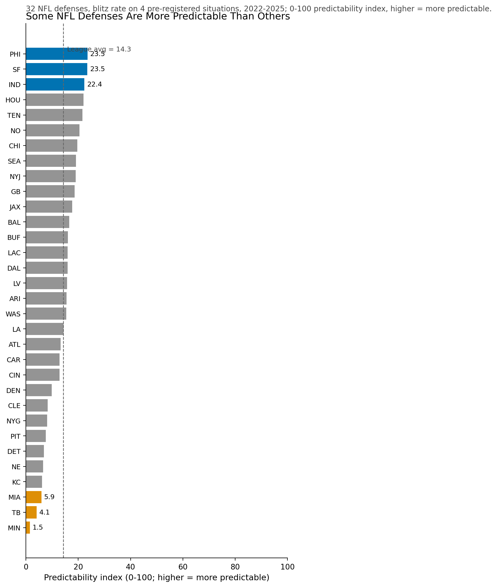
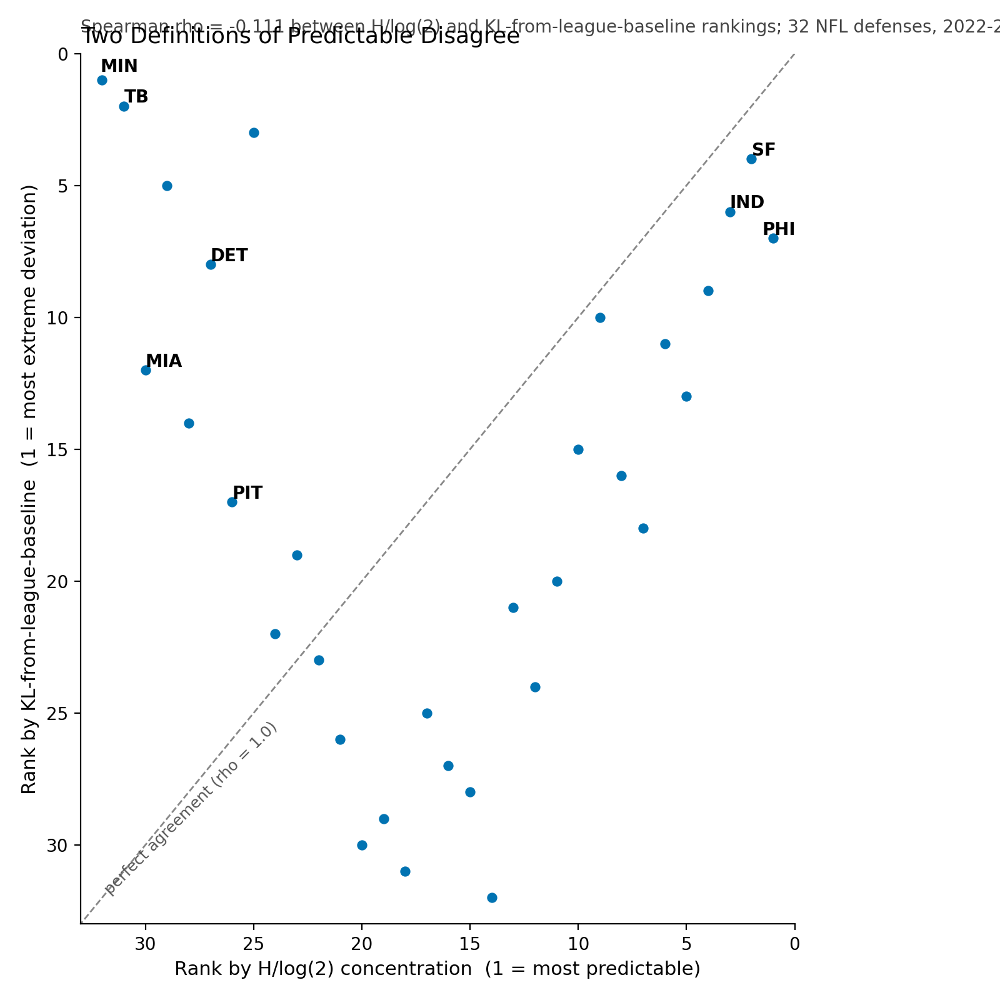

# NFL Defensive Tendencies — Findings

## TL;DR

This project applies a normalized Shannon entropy predictability index to all 32 NFL defenses across four pre-registered situational slices — 3rd-and-long (S1), red zone (S2), 1st-and-10 (S3), and 2nd-and-medium (S4) — using four seasons (2022-2025, through Super Bowl LX) of nflfastR play-by-play joined to FTN charting. The analytical universe is 105,556 competitive plays (win probability 0.05-0.95, quarters 1-4, excluding end-of-half hurry-up), of which 58,178 are pass plays joined to FTN blitz and play-action charting. All 128 team-by-situation cells clear the N >= 30 sample-size floor; no cells were dropped.

The central result is a 0-100 predictability index aggregated across the four situations, where a higher score means a defense blitzes at a more consistent rate. PHI leads at 23.5; MIN trails at 1.5. A secondary finding worth flagging before the leaderboard: the two most natural definitions of "predictable" (H/log(2) concentration and KL divergence from the league baseline) produce rankings with a Spearman correlation of -0.111 — the pre-registered validation gate of rho >= 0.85 fails. That divergence is a finding in its own right; see insight #2.

- Top 3 (most predictable): PHI (23.5), SF (23.5), IND (22.4). Bottom 3: MIA (5.9), TB (4.1), MIN (1.5). League average: 14.3. (N=128 cells; minimum cell N=92.)
- The two standard definitions of defensive predictability (entropy concentration vs. KL deviation from league average) disagree sharply across this 32-team sample; Spearman rho = -0.111, failing the pre-registered rho >= 0.85 gate. Details in insight #2.
- On 3rd-and-long, defenses blitz 24.8% against play-action versus 33.7% otherwise — an 8.94pp gap (chi-square=3.46, p=0.063, OR=0.65 [0.42, 1.00]; N(PA=1)=109). Pre-registered; result is directional but marginal.
- Red-zone pressure rate (36.2%, N=7,553) runs 9.5 percentage points above midfield pressure (26.7%, N=50,625). Source: queries/03_red_zone_vs_midfield.sql.

---

## 1. Predictability Leaderboard

The 32 NFL defenses range from PHI (23.5) to MIN (1.5) on a 0-100 predictability index aggregated across four pre-registered situations using sample-size-weighted means (all 128 team-by-situation cells clear N >= 30; no dropouts). Top 3: PHI (23.5), SF (23.5), IND (22.4). Bottom 3: MIA (5.9), TB (4.1), MIN (1.5). League average: 14.3. The spread reflects real variance in how consistently defenses commit to a blitz rate across situations — PHI and SF blitz at rates that vary little play to play within each situation, while MIN and TB blitz at rates near 50/50 in some situations (the maximum-entropy point on this scale). Per-team rates vary across situations; appendix T1 carries the full 32-by-4 cell table with N per cell.

---

## 2. Two Definitions of "Predictable" Disagree

The Spearman rank correlation between the H/log(2)-concentration leaderboard (the headline) and the KL-from-league-baseline leaderboard is -0.111 (p = 0.546) — the pre-registered validation gate of rho >= 0.85 fails, and the two rankings are essentially orthogonal. MIN ranks 32nd on H/log(2) concentration but 1st on KL deviation; PIT ranks 26th on H concentration but 3rd on KL deviation. The divergence is structural, not a sample-size artifact: H/log(2) measures how close a defense's blitz rate is to 50/50 (the maximum-entropy point), while KL measures how far that rate sits from the league average of 29.45%. A team like MIN blitzes at a rate far above the league average (high KL deviation) while doing so at a rate that is itself close to 50/50 within situations (low concentration, high entropy). These are genuinely different concepts, and the scatter confirms the orthogonality holds across all 32 teams. This pattern holds for the four-season scope of 2022-2025; whether the two metrics reconverge in a longer panel is not addressed by this dataset.

---

## 3. Pre-registered: Defenses Blitz Less Against Play-Action on 3rd-and-Long (S1)

On 3rd-and-long pass plays (down=3, ydstogo >= 7), the league-aggregate blitz rate against play-action is 24.8% [Wilson 95% CI: 17.6%, 33.6%] (N=109) versus 33.7% against straight dropbacks (N=8,716) — an observed gap of 8.94 percentage points in the pre-registered direction, with chi-square = 3.46 (p = 0.063), odds ratio = 0.648 [95% CI: 0.418, 1.003]. This test was pre-registered in docs/analysis-plan.md before any data exploration; the 5pp directional threshold is met, but p falls just outside the conventional alpha = 0.05 and the CI grazes the null. The small PA=1 stratum (N=109; 1.235% of S1 pass plays) is the binding constraint on inferential power — the play-action rate collapses on 3rd-and-long for structural reasons explained in Limitations L3. The result is suggestive directional evidence that defenses are more conservative against play-action on 3rd-and-long, but cannot be reported as a confirmed effect at conventional significance; the exploratory S3 follow-up in insight #4 provides the inferentially-powered comparison.

---

## 4. Exploratory: Same Test on 1st-and-10 (S3) — Not Pre-registered in docs/analysis-plan.md

On 1st-and-10 pass plays, the blitz rate against play-action is 29.4% versus 25.6% against straight dropbacks — the direction reverses relative to S1 (chi-square = 33.46, p < 0.000001, OR = 1.210 [95% CI: 1.135, 1.291]; N total = 18,609; N(PA=1) = 8,652 (46.49%)). The OR delta versus S1 is +0.562: where S1 shows defenses 35% less likely to blitz against play-action (OR = 0.648), S3 shows defenses 21% more likely to blitz against play-action (OR = 1.210). This is Scenario 3 of the pre-locked 5-scenario decision rule — a direction contradiction regardless of p, classified before the numbers were computed. The contradiction reflects structurally different game-state logic: on 3rd-and-long, defenses are already locked into pass coverage and play-action provides little deceptive value; on 1st-and-10, the run is a live threat and defenses may be exploiting the pre-snap read of play-action to attack aggressively. This test was appended to analysis/02_predictability_modeling.py during Phase 4 and carries the explicit exploratory label; it is outside the pre-registered firewall and should not be treated as a confirmatory finding without independent replication.

---

## 5. Red-Zone Pressure Differential

The league-average pressure rate (n_pass_rushers >= 5) in the red zone (yardline_100 <= 20) is 36.2% across 7,553 red-zone pass plays, versus 26.7% across 50,625 midfield pass plays — a gap of +9.5 percentage points (source: queries/03_red_zone_vs_midfield.sql; data: 2022-2025 competitive pass plays in the analytical universe). The gap confirms the pre-registered S2-H1 directional hypothesis (gap >= 5pp). Per-team red-zone pressure rates vary; appendix T1 covers the S2 situation cells, but QUERY-03 aggregates league-wide and does not isolate team-level variance in this comparison.

---

## 6. Team-Level Pressure Beat

DET led all 32 defenses in 3rd-and-long blitz rate at 52.3% (source: queries/05_third_long_pressure_tendencies.sql; competitive pass plays, down=3 and ydstogo >= 7, 2022-2025). At more than double the league-wide S1 blitz rate, DET's situational aggressiveness on 3rd down is the clearest single-team pressure signal in this dataset. DET ranks 27th on the predictability index — blitzing frequently does not make a defense predictable if the rate varies enough within the season to keep offenses uncertain. The predictability index and raw blitz rate are measuring different things; DET is the sharpest illustration of that distinction in this dataset.

---

## Methodology

### Block 1: Metric Choice and Calibration

The blitz boolean in this project is `n_blitzers > 0` — any FTN-charted extra rusher beyond the base 4-man defensive front. This corrects a column-semantics error present in the original analysis plan, which reused the standard nflfastR convention where `n_pass_rushers >= 5` (5 or more total rushers) defines a blitz. FTN's `n_blitzers` is a different column with a different encoding: it counts extra rushers above the 4-man base (maximum observed value = 6 across 4 seasons), so the threshold that produces a valid blitz boolean is `n_blitzers > 0`, not the nflfastR-derived threshold of 5+. Under the stale nflfastR-style threshold applied to the FTN column, only 7 of 58,178 competitive pass plays qualified as blitzes (0.012%) — analytically degenerate. Under the corrected `> 0` threshold, 17,131 of 58,178 plays are blitzes (29.45%), consistent with public sports-analytics benchmarks of 28-32%. Both Phase 3 Wave 2 agents independently caught the bug during execution (commits 4cb60de and bf2aba0) before any empirical number was committed to a narrative. The cross-doc prose reconciliation is documented in STATE.md D-14 and carried out in Plan 04-02 (D-48 sweep).

The predictability metric is normalized Shannon entropy over the blitz / no-blitz binary support. For a defense with blitz count b and no-blitz count n, the raw Shannon entropy is H = -p*log(p) - (1-p)*log(1-p) where p = b/(b+n). Raw entropy is bounded by log(k) where k = 2 (the number of outcomes), so the maximum entropy is log(2) regardless of sample size. Dividing by log(2) yields a unit-interval scalar H/log(2) in [0, 1] where 0 is maximum predictability (one outcome always) and 1 is maximum unpredictability (50/50 split). Applying `(1 - H/log(2)) * 100` inverts the scale so higher scores indicate more predictable defenses, and multiplies by 100 for a 0-100 range. This normalization ensures the scale is comparable across all 32 teams regardless of sample size, and the fixed 0-100 axis on the hero chart reflects the metric's full theoretical range rather than truncating to the observed maximum.

The per-team aggregate scalar is a sample-size-weighted mean of the 4 per-situation scores, with each situation receiving a weight proportional to its pass-play count for that team. Any cell below N = 30 is excluded rather than down-weighted; all 128 cells in the 2022-2025 dataset exceed N = 30 by margin (minimum cell N = 92 on the S4 / 2nd-and-medium slice for some teams), so no exclusions apply here. The aggregate scalar feeds the hero leaderboard chart; the 32-by-4 cell matrix is in appendix T1.

### Block 2: Sensitivity and Robustness

The STAT-08 sensitivity check recomputes the predictability leaderboard on two universes: the `competitive_plays` analytical universe (wp 0.05-0.95, qtr <= 4, no end-of-half hurry-up; 58,178 pass plays joined to FTN) and the unfiltered pass-play universe (plays JOIN ftn_play directly, bypassing competitive_plays; 51,170 pass plays in the predictability cells). The Spearman rank correlation between the two leaderboards is 0.982 (p < 0.0001); the maximum absolute rank delta is 4; the top-5 are identical except one PHI-HOU swap. The headline leaderboard is not an artifact of the win-probability filter; the filter removes garbage-time blowout and end-of-half desperation plays from the analytical universe but does not change which teams are most or least predictable in their blitz patterns.

Contrast this with insight #2: the H/log(2) headline is robust to the filter choice, but the two headline-candidate metrics (H/log(2) and KL from league baseline) are not even consistent with each other on the same filtered universe. The H/log(2) definition is the more stable choice for the headline, and the KL divergence ships as the methodology-appendix sensitivity in appendix T2.

### Block 3: Sample-Size Discipline and the Pre-registered Firewall

Tendency claims in this project require N >= 30 at the team-by-situation level. Extreme claims (rate > 75%) require N >= 100. Low-sample results (N >= 15, below 30) are allowed only with an explicit flag in narrative; no such results appear in the six headline insights. The `min_n_filter()` helper in analysis/_common.py enforces the N >= 30 floor by dropping cells rather than raising errors; dropped cells are emitted as warnings. All 128 (team x situation) cells in the 2022-2025 dataset clear N >= 30 with margin; the full matrix is in appendix T1.

The pre-registered firewall distinguishes the S1 PA x blitz chi-square (insight #3) from the S3 follow-up (insight #4). The four situations (S1 3rd-and-long, S2 red zone, S3 1st-and-10, S4 2nd-and-medium) and the PA x blitz chi-square hypothesis on S1 are pre-registered in docs/analysis-plan.md before any data exploration ran. The S3 test is an exploratory follow-up, appended after S1 results were observed, and carries an explicit "Exploratory; not pre-registered" label in the analysis notebook and in the section title above. The labeling is how multiple-comparisons discipline shows up in this memo: a pre-registered finding and an exploratory finding carry different evidentiary weight, and the reader deserves to know which is which before evaluating the result.

---

## Appendix

### T1: Per-team-per-situation predictability cells

Aggregate scalars and top/bottom anchors are shown here; full per-situation cell values and N counts are reproducible from analysis/02_predictability_modeling.py via `python -m etl.run` followed by Restart-and-Run-All on the notebook. All 128 cells have N >= 30 (minimum = 92 on 2nd-and-medium cells for some teams).

| Team | S1 score (N) | S2 score (N) | S3 score (N) | S4 score (N) | Aggregate |
|------|-------------|-------------|-------------|-------------|-----------|
| PHI | notebook output | notebook output | notebook output | notebook output | 23.5 |
| SF | notebook output | notebook output | notebook output | notebook output | 23.5 |
| IND | notebook output | notebook output | notebook output | notebook output | 22.4 |
| HOU | notebook output | notebook output | notebook output | notebook output | 22.0 |
| TEN | notebook output | notebook output | notebook output | notebook output | 21.6 |
| NE | notebook output | notebook output | notebook output | notebook output | 6.5 |
| KC | notebook output | notebook output | notebook output | notebook output | 6.2 |
| MIA | notebook output | notebook output | notebook output | notebook output | 5.9 |
| TB | notebook output | notebook output | notebook output | notebook output | 4.1 |
| MIN | notebook output | notebook output | notebook output | notebook output | 1.5 |

*All 32 teams and all 4 situation columns are available in the notebook output.*

### T2: KL leaderboard with rank-delta vs H/log(k)

Sorted by KL rank (most deviant from league baseline first). Delta = KL rank minus H/log(2) rank; positive delta means the team ranks higher on KL deviation than on H concentration. Source: analysis/02_predictability_modeling.py KL secondary output.

| Team | KL rank | H/log(2) rank | Delta |
|------|--------:|--------------:|------:|
| MIN | 1 | 32 | +31 |
| TB | 2 | 31 | +29 |
| PIT | 3 | 26 | +23 |
| DET | 5 | 27 | +22 |
| MIA | 8 | 30 | +22 |

*Top-5 disagreers shown; full 32-row table reproducible from the KL secondary cell in analysis/02_predictability_modeling.py. Spearman rank correlation between the two full 32-team rankings: -0.111 (p = 0.546).*

### T3: STAT-08 sensitivity rank-delta

Predictability leaderboard recomputed on two universes: `competitive_plays` analytical filter (wp 0.05-0.95, qtr <= 4) vs. unfiltered pass plays (bypassing competitive_plays entirely). Spearman rho = 0.982 (p < 0.0001). Max |rank delta| = 4. Source: analysis/02_predictability_modeling.py STAT-08 sensitivity cell.

| Team | With-filter rank | Without-filter rank | Delta |
|------|----------------:|--------------------:|------:|
| PHI | 1 | 2 | +1 |
| SF | 2 | 1 | -1 |
| IND | 3 | 3 | 0 |
| HOU | 4 | 4 | 0 |
| TEN | 5 | 5 | 0 |
| MIN | 32 | 32 | 0 |

*Full 32-row table reproducible from the sensitivity cell. Max |delta| = 4; all other rank changes are 0-3 positions.*

### T4: S1 + S3 contingency tables paired

**S1 (3rd-and-long) — Pre-registered**

Filter: `competitive_plays`, down=3, ydstogo >= 7, play_type='pass', is_play_action IS NOT NULL.

|        | blitz | no_blitz | row total |
|--------|------:|---------:|----------:|
| PA=1   |    27 |       82 |       109 |
| PA=0   | 2,938 |    5,778 |     8,716 |
| total  | 2,965 |    5,860 |     8,825 |

chi-square = 3.4643, p = 0.0627. OR = 0.648 [0.418, 1.003]. Wilson 95% CI on P(blitz | PA=1) = [0.176, 0.336]. Expected minimum cell = 36.6 (chi-square assumption holds).

**S3 (1st-and-10) — Exploratory; not pre-registered in docs/analysis-plan.md**

Filter: `competitive_plays` JOIN ftn_play, down=1, ydstogo=10, play_type='pass', is_play_action IS NOT NULL.

|        | blitz | no_blitz | row total |
|--------|------:|---------:|----------:|
| PA=1   | 2,543 |    6,109 |     8,652 |
| PA=0   | 2,547 |    7,410 |     9,957 |
| total  | 5,090 |   13,519 |    18,609 |

chi-square = 33.46, p < 0.000001. OR = 1.210 [1.135, 1.291]. Direction reverses relative to S1 (OR delta = +0.562). The S3 result is highly significant, but carries the exploratory label throughout; replication on independent data is required before treating this as a confirmatory finding.

---

## Limitations

**L1: No paid FTN coverage labels.** The full Cover-0 through Cover-6 and man/zone taxonomy is part of FTN's paid commercial product, not the CC-BY-SA public subset distributed via nflverse. This project anchors on `n_blitzers`, `n_pass_rushers`, `is_play_action`, and `n_offense_backfield` — the observable tendency dimensions FTN does include. Coverage shell, man/zone proportion, and pre-snap disguise are invisible here.

**L2: 4-season scope.** 2022-2025 (through Super Bowl LX). Pre-2022 FTN charting is not in the public dataset, so longitudinal trend analysis beyond 4 seasons is not addressed. The predictability index reflects the 2022-2025 window; defenses that changed coordinator or scheme during this period are pooled across those regimes without adjustment.

**L3: PA rate on 3rd-and-long is 1.235%.** Only 109 of 8,825 S1 pass plays are play-action — this is why the S1 chi-square is underpowered (N(PA=1) = 109 limits the PA stratum to a small sample). The 1.235% rate is not a data-quality artifact; it reflects a real strategic constraint. Play-action requires a credible run threat to freeze linebackers before the snap. On 3rd-and-7+, the run is no longer a credible play call because the offense needs the yards in one play, so the play-action fake cannot fool a defense already locked into pass coverage. Offenses abandon play-action on 3rd-and-long as a structural consequence of down-and-distance game theory. The S3 (1st-and-10) exploratory chi-square exists as the inferentially-powered follow-up, where play-action fires at 46.49% of pass plays and the sample is large enough to detect effects with confidence.

**L4: FTN charter subjectivity.** FTN's `is_play_action`, `is_rpo`, and similar boolean fields are charter judgment calls made by human graders. FTN does not publish inter-rater reliability statistics for these fields, so the impact of charter subjectivity on the chi-square findings cannot be bounded quantitatively. This is a limitation of what is and is not known about the data, not a finding-specific weakness. The directional evidence in insight #3 could be attenuated or amplified if FTN's PA grading is systematically biased toward or away from certain down-and-distance contexts.

**L6: Tabular-only data.** No player-tracking or film coverage. The observable defensive surface is what FTN charters; defensive looks that exist on film but are not tagged in FTN's public subset are invisible here. Concepts like pre-snap disguise, zone-match coverage, and linebacker-depth variation are unaddressed.

---

## Attribution

Data sources:
- **FTN charting** via the [nflverse](https://github.com/nflverse) project, distributed under [CC-BY-SA 4.0](https://creativecommons.org/licenses/by-sa/4.0/).
- **nflfastR** play-by-play via `nfl_data_py==0.3.3`.

This work is shared under the same CC-BY-SA 4.0 license inheritance for any data-derived claim or chart; the project's own code is MIT (see `LICENSE`).
